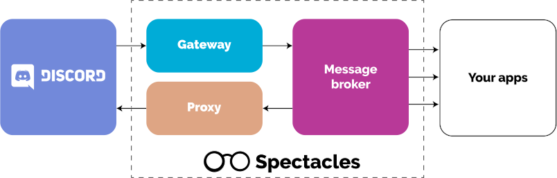

Spectacles is a collection of applications and libraries designed to help you make stable,
microservice-oriented Discord bots.

A basic Spectacles bot runs 4 services:

1. Gateway
2. Proxy
3. RabbitMQ
4. Command handler

The Spectacles organization provides the gateway and proxy services. RabbitMQ is developed
independently. You are responsible for writing your own command handler (that's why you're here,
afterall).

Each of these services is fully stateless and can be easily scaled up or down across machines.

## Gateway

The gateway is a separate application that is solely responsible for connecting to Discord,
ingesting events, and publishing them to RabbitMQ. It handles everything related to the Discord
gateway:

- Sharding
- Intents
- Reconnection
- Gateway ratelimits

## Proxy

The proxy is responsible for handling all of the outgoing HTTP requests to Discord. It ensures that
your bot complies with Discord's ratelimits under any circumstance. Eventually, the proxy will also
cache data and ensure that you never run into a performance bottleneck while fetching Discord data
in your application.

Your applications publish requests to RabbitMQ. The proxy consumes these and sends them to
Discord as soon as possible. The proxy is responsible for:

- HTTP ratelimits
- Caching (soon)

## RabbitMQ

RabbitMQ is a message broker that Spectacles relies on to consistently deliver messages to each
service. You don't need to know how it works or how to use it, only that it's responsible for
delivering messages between your applications.

## Command Handler

Your command handler is where all of your normal bot logic happens. Here you consume messages from
the gateway, do any bot logic that you want, and maybe send messages back to the proxy. Spectacles
provides numerous client libraries that you can use to interact with the other Spectacles services.

- JavaScript
- C#
- Go
- Rust
